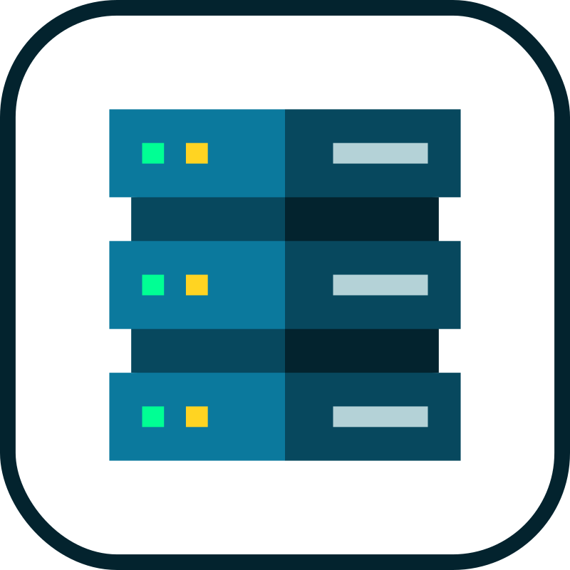

  Hi there 👋, I'm André!

  I'm an Information Systems student at <strong>IFBA (Campus Vitória da Conquista, Brazil)</strong>.

  I am a junior developer with a strong focus on <strong>Backend development (Python & Java)</strong> and a passion for technology. I am actively seeking my first job opportunity where I can apply my skills in software engineering, data, and infrastructure.

  My key interests include <strong>AI</strong>, <strong>Cybersecurity</strong>, and <strong>Data Analysis</strong>.

  
  

---

## 🚀 My Portfolio

These projects demonstrate my ability to apply academic knowledge to practical challenges.

### 1. Workshop Management System (Python & SQL)
* **Description:** A Python CLI application to manage a mechanic workshop. It handles customer/vehicle registration, service management, invoicing, and complex reporting.
* **Technologies:** Python, MySQL.
* **Skills Demonstrated:** Relational Database Design, complex SQL queries (JOINs, Aggregates), and code organization (separation of concerns).
* **[Link to Repository](https://github.com/andreluizdev01/trabalho-roberta)**

### 2. Web Server Demo (Docker & API)
* **Description:** An academic project to demonstrate the containerization of Nginx and Apache web servers using Docker. It includes a dynamic website that consumes the Open-Meteo API in real-time using JavaScript to display weather data.
* **Technologies:** Docker, JavaScript (Fetch API), HTML/CSS, Nginx, Apache.
* **Skills Demonstrated:** Writing custom Dockerfiles, consuming third-party REST APIs (JSON), and web infrastructure fundamentals.
* **[Link to Repository](https://github.com/andreluizdev01/Atividade-programacao-web-faculdade)**

---

## 💻 My Tech Stack & Tools

### Programming Languages

  
  
  
  
  

### Backend & Databases

  
  
  
  

### Infrastructure & DevOps

  
  
  

### Data Analysis

  
  <em>(Experience with Data Analysis in Python)</em>

### Desktop Development

  <em>(Experience with Java GUI / Swing)</em>

### IDEs & Tools

  
  
  
  
  

---

## 🎓 Academic Foundations

My Information Systems coursework has provided me with a solid theoretical foundation in:
* Software Engineering & Project Management
* Systems Analysis and Design
* Human-Computer Interaction (HCI / Usability)
* Computer Networking Fundamentals
* Data Organization and Analysis

---

  

  

